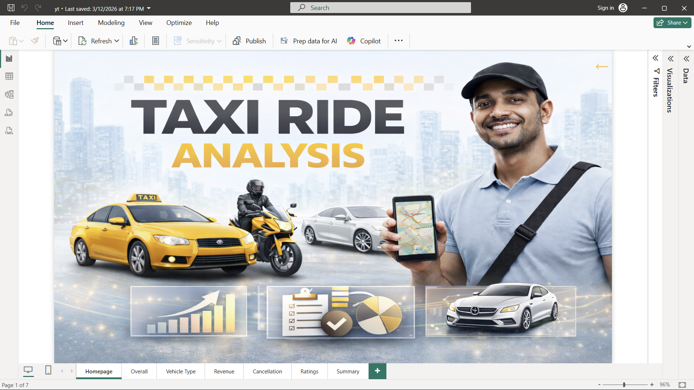
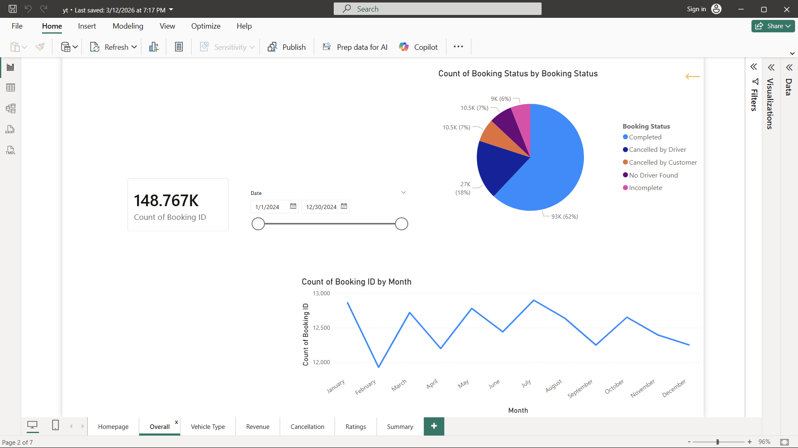
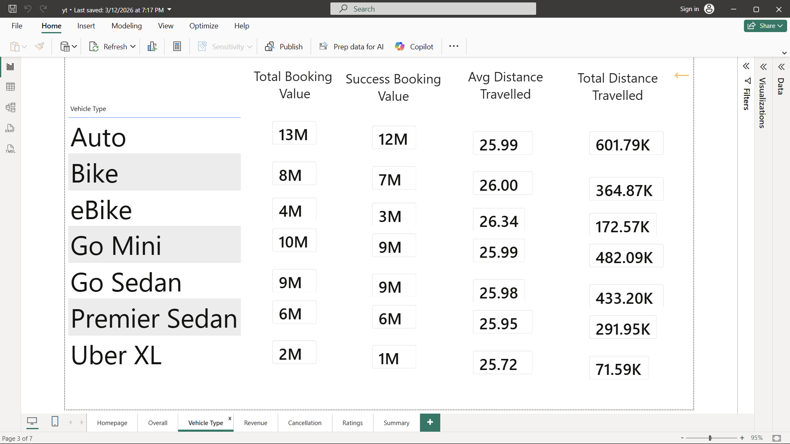
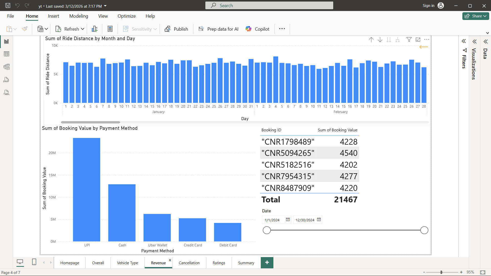
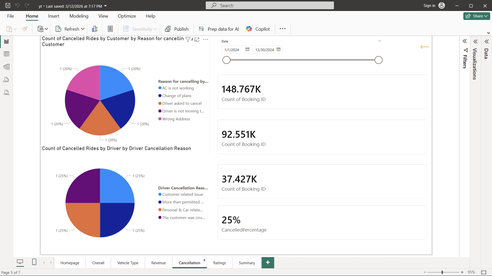

# 🚖 Taxi Ride Analysis - Power BI Project

📊 A data analytics project built using Power BI to analyze taxi ride data and generate meaningful insights related to ride patterns, revenue, and customer behavior.

---

## 🚀 Project Overview

This project focuses on analyzing taxi ride booking data using Power BI dashboards.
The goal is to transform raw data into **interactive visual insights** that help understand business performance and user behavior.

Power BI dashboards are widely used to analyze ride trends, revenue, and operational efficiency in real-world transportation systems.

---

## ✨ Key Features

* 📈 Ride volume analysis (daily / monthly trends)
* 🚦 Booking status breakdown (completed / cancelled rides)
* 💰 Revenue insights and payment method analysis
* 🚗 Vehicle type performance comparison
* ⭐ Customer & driver behavior insights
* 📊 Interactive dashboards with filters and slicers

---

## 📊 Dashboard Insights

This project helps answer questions like:

* When are peak ride hours? ⏰
* Which vehicle type generates more revenue? 🚗
* What are the common cancellation reasons? ❌
* How do customers behave across different time periods? 📅

Such dashboards are commonly used to analyze ride demand, customer trends, and revenue distribution.

---

## 🛠️ Tech Stack

* 📊 Power BI
* 📂 CSV Dataset (`rideBookings.csv`)
* 🔄 Power Query (Data Cleaning & Transformation)
* 📐 DAX (Data Analysis Expressions)

---

## 📂 Project Structure

```
Taxi_Ride_Analysis_Power_BI/
│
├── rideBookings.csv
├── yt.pbix
├── Screenshot1.png
├── Screenshot2.png
├── Screenshot3.png
├── Screenshot4.png
├── Screenshot5.png
├── Screenshot6.png
├── Screenshot7.png
└── README.md
```

---

## 📸 Dashboard Preview

### 📊 Overview Dashboard



### 🚗 Vehicle Analysis



### 💰 Revenue Analysis



### ❌ Cancellation Analysis



### ⭐ Ratings Insights



*(Add or reorder screenshots as needed)*

---

## ⚙️ How to Use

1️⃣ Download the repository

```bash
git clone https://github.com/Sahil-Shrivas/Taxi_Ride_Analysis_Power_BI-Project.git
```

2️⃣ Open `.pbix` file in Power BI

3️⃣ Explore dashboards using filters and visuals

---

## 🎯 Use Cases

* Business Intelligence & Data Analytics 📊
* Transportation / Ride-sharing analysis 🚖
* Dashboard design practice 💻
* Portfolio project for data analyst roles 💼

---

## 📈 Learning Outcomes

* Data cleaning using Power Query
* Creating KPIs and dashboards
* Writing DAX measures
* Data visualization & storytelling

---

## 🤝 Contributing

Feel free to fork this repo and improve it 🚀

---

## ⭐ Support

If you like this project, give it a ⭐ on GitHub!

---
